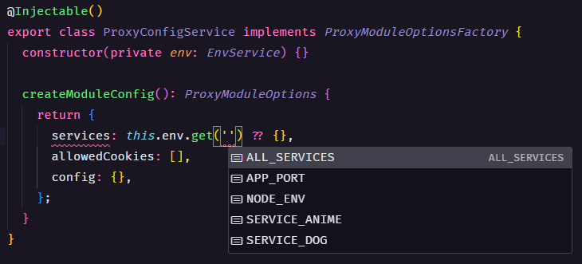

# NestJS Proxy module

### This is fork based on [Finastra - Node Proxy Lib](https://github.com/Finastra/finastra-nodejs-libs/tree/develop/libs/proxy)

## How to use

You can import the module like so :

#### `app.module.ts`

```typescript
ProxyModule.forRootAsync({
  imports: [EnvService],
  useClass: ProxyConfigService,
}),
```

#### `proxy-config.service.ts`

```typescript
import { Injectable } from '@nestjs/common';
import { EnvService } from '../environments/env.service';
import { ProxyModuleOptions, ProxyModuleOptionsFactory } from './proxy.interface';

@Injectable()
export class ProxyConfigService implements ProxyModuleOptionsFactory {
  constructor(private env: EnvService) {}

  createModuleConfig(): ProxyModuleOptions {
    return {
      services: this.env.get('ALL_SERVICES') ?? {},
      allowedCookies: [],
      config: {},
    };
  }
}
```
## Environments

#### `env.ts`

```ts
import { z } from 'zod';

function refineServiceUrl(service: string) {
  return z
    .string()
    .url()
    .transform((value) => ({ [service]: value }));
}

export const envSchema = z
  .object({
    // Application
    NODE_ENV: z
      .enum(['development', 'production', 'test'])
      .default('development'),
    APP_PORT: z.number({ coerce: true }).default(8081),

    // Services
    SERVICE_DOG: refineServiceUrl('dog'),
    SERVICE_ANIME: refineServiceUrl('anime'),
  })
  .transform((values) => {
    const servicesSchema = z.record(z.string(), z.string());
    const SERVICES: Record<string, string> = {};

    for (const envKey of Object.keys(values)) {
      if (String(envKey).startsWith('SERVICE_')) {
        Object.assign(SERVICES, values[envKey]);
      }
    }

    return {
      ...values,
      ALL_SERVICES: servicesSchema.parse(SERVICES),
    };
  });

export type Env = z.infer<typeof envSchema>;

```
You can configure all services in `.env` file.
```bash
# Services
SERVICE_DOG="https://dog.ceo/api/breeds/image/random"
SERVICE_ANIME="https://animechan.io/api/v1/quotes/random"
```

When the application starts, all environments starting with `SERVICE_` are transformed and stored in a new variable `ALL_SERVICES` which is used to configure the available routes.

#### `env.service.ts`
Import where you want `EnvService` to get typed all environments.



## Configuration

Whether synchronously or asynchronously, the module takes two parameters (both optionals).

- **services** : which is a collection of urls with a given id so that you can query them more efficiently
- **config** : which is the configuration from [http-proxy](https://github.com/http-party/node-http-proxy) which we're using under the hood. Find the official documentation of this configuration [here](https://github.com/http-party/node-http-proxy#options).

### Token forwarding

In this repository fork, by default, OAuth token are forwarded to the service call being proxied. 

> [!WARNING]
> Be careful to only forward tokens to internal services. Don't forward the token to third party services.

### Cookies forwarding

Cookies are not proxied by default. You can opt in by listing the cookie names in the `allowedCookies` option:

```typescript
allowedCookies: ['cookie1', 'cookie2'],
```

### Default module configuration

If you do not provide any, the default proxy configuration for this module can be found in [proxy.constants.ts](./src/module/proxy/proxy.constants.ts), under `defaultProxyOptions`

## Client-side usage examples

```typescript
const serverUri = 'http://localhost:3000';
const serviceName = 'dog';

fetch(serverUri, {
  headers: {
    'x-service-name': serviceName
  }
});
```

Forked by [Finastra - Node Proxy Lib](https://github.com/Finastra/finastra-nodejs-libs/tree/develop/libs/proxy)

Modified by [Gabriel Duarte](https://github.com/jdgabriel)